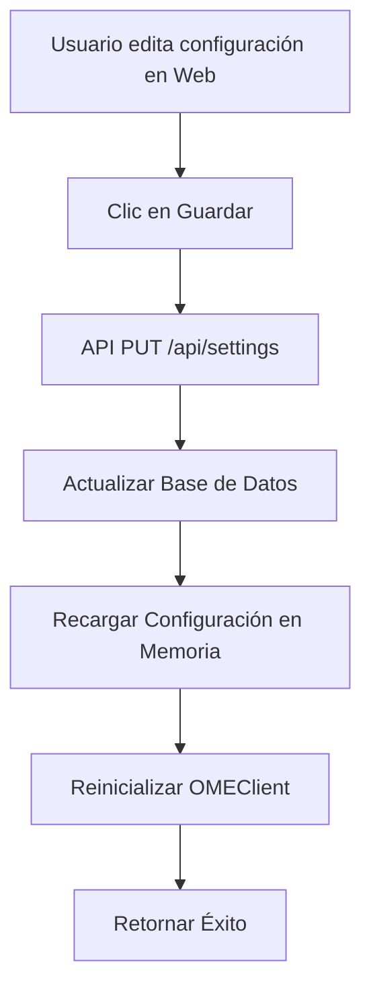
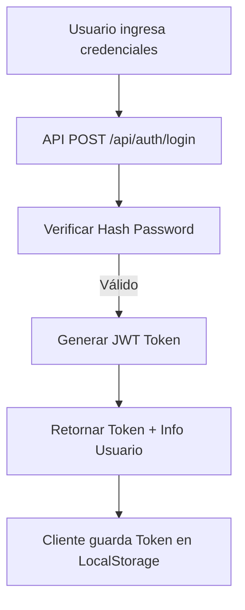

# Documentación Completa del Proyecto OvenMediaUI

## Índice
1. [Visión General del Sistema](#visión-general-del-sistema)
2. [Arquitectura del Proyecto](#arquitectura-del-proyecto)
3. [Estructura de Directorios](#estructura-de-directorios)
4. [Patrones de Desarrollo](#patrones-de-desarrollo)
5. [Componentes Principales](#componentes-principales)
6. [Flujos de Trabajo](#flujos-de-trabajo)
7. [Guías de Desarrollo](#guías-de-desarrollo)
8. [APIs y Endpoints](#apis-y-endpoints)
9. [Base de Datos](#base-de-datos)
10. [Frontend y JavaScript](#frontend-y-javascript)
11. [Seguridad](#seguridad)
12. [Deployment y Configuración](#deployment-y-configuración)

---

## Visión General del Sistema

**OvenMediaUI** es una interfaz web moderna e intuitiva desarrollada en **Python Flask** para configurar y gestionar el servidor de streaming **OvenMediaEngine**. El sistema permite:

- **Gestión de Configuración**: Edición visual de `Server.xml` con validación.
- **Gestión de VirtualHosts**: Crear, editar y eliminar VHosts y Aplicaciones.
- **Monitoreo**: Visualización de streams activos y estadísticas en tiempo real.
- **Seguridad**: Autenticación JWT, roles de usuario y logs de auditoría.
- **Configuración Centralizada**: Sistema de configuración almacenado en base de datos.

### Tecnologías Principales
- **Backend**: Flask 3.0, Python 3.8+
- **Base de Datos**: SQLite (SQLAlchemy ORM)
- **Frontend**: HTML5, CSS3 (Diseño propio), JavaScript Vanilla
- **Integración**: REST API de OvenMediaEngine, XML Parsing
- **Seguridad**: Flask-JWT-Extended, Bcrypt

---

## Arquitectura del Proyecto

### Patrón Arquitectónico
El sistema sigue una **arquitectura modular basada en Flask Blueprints** con separación clara de responsabilidades:

```
┌─────────────────┐    ┌─────────────────┐    ┌─────────────────┐
│   Frontend      │    │   Backend       │    │   Database      │
│   (Templates +  │◄──►│   (Flask +      │◄──►│   (SQLite)      │
│    JavaScript)  │    │    Blueprints)  │    │                 │
└─────────────────┘    └─────────────────┘    └─────────────────┘
         ▲                       ▲                       ▲
         │                       │                       │
┌─────────────────┐    ┌─────────────────┐    ┌─────────────────┐
│   Static Files  │    │   Services      │    │   External      │
│   (CSS, JS)     │    │   (OME Client,  │◄──►│   (OvenMedia    │
│                 │    │    XML Parser)  │    │    Engine API)  │
└─────────────────┘    └─────────────────┘    └─────────────────┘
```

### Principios de Diseño
1. **Modularidad**: Cada funcionalidad (Auth, Server, VHosts) es un Blueprint independiente.
2. **Servicios**: La lógica de negocio compleja (comunicación con OME, parsing XML) está aislada en servicios.
3. **Configuración en BD**: La configuración de la app reside en la base de datos, no en archivos.
4. **API First**: El frontend consume una API RESTful bien definida.

---

## Estructura de Directorios

```
OvenMediaUI/
├── app.py                      # Aplicación principal Flask (Factory Pattern)
├── config.py                   # Configuración del sistema (BD + Env fallback)
├── requirements.txt            # Dependencias Python
├── 
├── models/                     # Modelos de datos (SQLAlchemy)
│   ├── user.py                 # Usuarios y Roles
│   ├── settings.py             # Configuración del sistema
│   ├── audit.py                # Logs de auditoría
│   └── configuration.py        # Snapshots de Server.xml
├── 
├── services/                   # Lógica de negocio
│   ├── ome_client.py           # Cliente HTTP para API de OME
│   ├── xml_parser.py           # Parser bidireccional XML <-> Dict
│   └── config_manager.py       # Gestor de Server.xml y Snapshots
├── 
├── api/                        # Controladores (Blueprints)
│   ├── auth.py                 # Autenticación
│   ├── settings.py             # Gestión de configuración
│   ├── server.py               # Configuración del servidor
│   ├── virtualhosts.py         # Gestión de VHosts
│   └── ...
├── 
├── templates/                  # Plantillas HTML (Jinja2)
│   ├── base.html               # Layout principal
│   ├── settings.html           # Página de configuración
│   └── ...
├── 
└── static/                     # Archivos estáticos
    ├── css/                    # Estilos (main.css)
    └── js/                     # JavaScript (app.js)
```

---

## Patrones de Desarrollo

### 1. Patrón de Modelo (SQLAlchemy)

**Estructura Estándar de Modelo:**
```python
# models/[Entidad].py
from . import db

class [Entidad](db.Model):
    id = db.Column(db.Integer, primary_key=True)
    # ... campos ...

    def to_dict(self):
        """Serialización a JSON"""
        return {
            'id': self.id,
            # ...
        }
    
    @classmethod
    def get_by_id(cls, id):
        return cls.query.get(id)
```

### 2. Patrón de Rutas (Blueprints)

**Estructura Estándar de Ruta:**
```python
# api/[Entidad].py
from flask import Blueprint, jsonify, request
from flask_jwt_extended import jwt_required
from models import [Entidad]

bp = Blueprint('[entidad]', __name__)

@bp.route('/', methods=['GET'])
@jwt_required()
def get_all():
    items = [Entidad].query.all()
    return jsonify([i.to_dict() for i in items])

@bp.route('/', methods=['POST'])
@jwt_required()
def create():
    data = request.get_json()
    # ... lógica de creación ...
    return jsonify(item.to_dict()), 201
```

### 3. Patrón de JavaScript

**Estructura Estándar (`app.js`):**
```javascript
// Funciones asíncronas para comunicación API
async function load[Entidad]() {
    try {
        const data = await apiRequest('/[entidad]/');
        render[Entidad](data);
    } catch (error) {
        showToast(error.message, 'error');
    }
}

// Renderizado dinámico
function render[Entidad](items) {
    const container = document.getElementById('container');
    container.innerHTML = items.map(item => `
        <div class="card">...</div>
    `).join('');
}
```

---

## Componentes Principales

### 1. Settings (Configuración)
Gestiona la configuración de la aplicación almacenada en base de datos.
- **Modelo**: `models/settings.py`
- **API**: `api/settings.py`
- **Características**: Categorización, encriptación de secretos, recarga en caliente.

### 2. OMEClient
Cliente HTTP wrapper para la REST API de OvenMediaEngine.
- **Ubicación**: `services/ome_client.py`
- **Funciones**: `get_vhosts()`, `create_app()`, `get_streams()`, etc.
- **Manejo de Errores**: Captura excepciones de conexión y códigos de estado HTTP.

### 3. XMLParser
Utilidad para manipular el archivo `Server.xml`.
- **Ubicación**: `services/xml_parser.py`
- **Funciones**: `parse_file()`, `dict_to_xml()`, `validate_xml()`.
- **Uso**: Convierte XML a diccionario Python para manipulación fácil y viceversa.

---

## Flujos de Trabajo

### 1. Flujo de Actualización de Configuración


### 2. Flujo de Autenticación


---

## Guías de Desarrollo

### Crear Nuevo Módulo

1. **Crear Modelo** (si requiere persistencia): `models/nuevo_modulo.py`
2. **Crear Servicio** (si requiere lógica compleja): `services/nuevo_servicio.py`
3. **Crear Blueprint API**: `api/nuevo_modulo.py`
4. **Registrar Blueprint**: En `app.py`
5. **Crear Template HTML**: `templates/nuevo_modulo.html`
6. **Agregar Lógica JS**: En `static/js/app.js` o archivo separado.

---

## APIs y Endpoints

### Autenticación
- `POST /api/auth/login`: Iniciar sesión
- `GET /api/auth/me`: Info usuario actual

### Configuración
- `GET /api/settings/`: Listar configuraciones
- `PUT /api/settings/`: Actualizar configuraciones
- `POST /api/settings/reload`: Recargar configuración

### Server & VHosts
- `GET /api/server/config`: Leer Server.xml
- `GET /api/virtualhosts/`: Listar VHosts
- `POST /api/virtualhosts/`: Crear VHost

---

## Base de Datos

### Esquema (SQLite)

**Tablas Principales:**
- `users`: Usuarios y roles (Admin, Operator, Viewer).
- `settings`: Configuración clave-valor del sistema.
- `audit_logs`: Registro histórico de acciones.
- `configuration_snapshots`: Versiones de respaldo de Server.xml.

---

## Frontend y JavaScript

### Estructura
- **CSS**: `static/css/main.css` - Sistema de diseño propio (Dark Theme, Glassmorphism).
- **JS**: `static/js/app.js` - Lógica SPA, manejo de API, modales, notificaciones.

### Librerías
- **Font Awesome**: Iconos.
- **Inter Font**: Tipografía.
- **No jQuery**: Todo es Vanilla JS moderno (ES6+).

---

## Seguridad

- **JWT**: Tokens de acceso con expiración configurable.
- **RBAC**: Control de acceso basado en roles en cada endpoint.
- **Audit Logging**: Todo cambio crítico queda registrado.
- **Secret Management**: Las claves sensibles en BD se ocultan en la API.

---

## Deployment y Configuración

### Instalación Simplificada

1. **Instalar Dependencias**:
```bash
pip install -r requirements.txt
```

2. **Ejecutar Aplicación**:
```bash
python app.py
```
*La base de datos y configuraciones se inicializan automáticamente.*

3. **Configurar**:
Acceder a `http://localhost:5000` (Admin/admin123) y configurar desde el menú **Configuración**.

### Producción
Usar Gunicorn:
```bash
gunicorn -w 4 -b 0.0.0.0:5000 app:app
```
